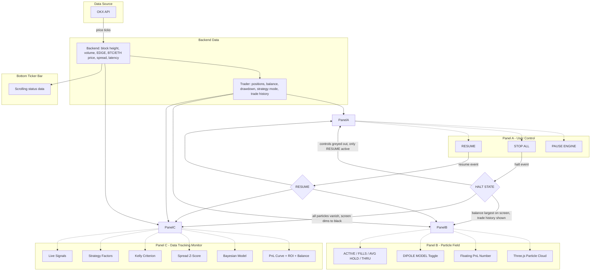

```mermaid
graph TD
    subgraph Data Source
        OKX[OKX API]
    end
 
    subgraph Backend Data
        Backend[Backend: block height, volume, EDGE, BTC/ETH price, spread, latency]
        Trader[Trader: positions, balance, drawdown, strategy mode, trade history]
    end
 
    subgraph Panel A - User Control
        PauseBtn[PAUSE ENGINE]
        StopAll[STOP ALL]
        ResumeBtn[RESUME]
    end
 
    subgraph Panel B - Particle Field
        Particles[Three.js Particle Cloud]
        PnLFloat[Floating PnL Number]
        DipoleToggle[DIPOLE MODEL Toggle]
        BottomStats[ACTIVE / FILLS / AVG HOLD / THRU]
    end
 
    subgraph Panel C - Data Tracking Monitor
        PnLCurve[PnL Curve + ROI + Balance]
        Bayes[Bayesian Model]
        SpreadZ[Spread Z-Score]
        Kelly[Kelly Criterion]
        Factors[Strategy Factors]
        Signals[Live Signals]
    end
 
    subgraph Bottom Ticker Bar
        Ticker[Scrolling status data]
    end
 
    OKX -->|price ticks| Backend
    Backend --> Trader
    Backend --> PanelC
    Trader --> PanelA
    Trader --> PanelB
    Trader --> PanelC
 
    PanelC -.-> PnLCurve
    PanelC -.-> Bayes
    PanelC -.-> SpreadZ
    PanelC -.-> Kelly
    PanelC -.-> Factors
    PanelC -.-> Signals
 
    PanelA -.-> PauseBtn
    PanelA -.-> StopAll
    PanelA -.-> ResumeBtn
 
    PanelB -.-> Particles
    PanelB -.-> PnLFloat
    PanelB -.-> DipoleToggle
    PanelB -.-> BottomStats
 
    Backend --> Ticker
 
    StopAll -->|halt event| HaltState{HALT STATE}
    HaltState -->|controls greyed out, only RESUME active| PanelA
    HaltState -->|balance largest on screen, trade history shown| PanelB
    HaltState -->|all particles vanish, screen dims to black| PanelC
 
    ResumeBtn -->|resume event| Resume{RESUME}
    Resume --> PanelA
    Resume --> PanelB
    Resume --> PanelC
```
